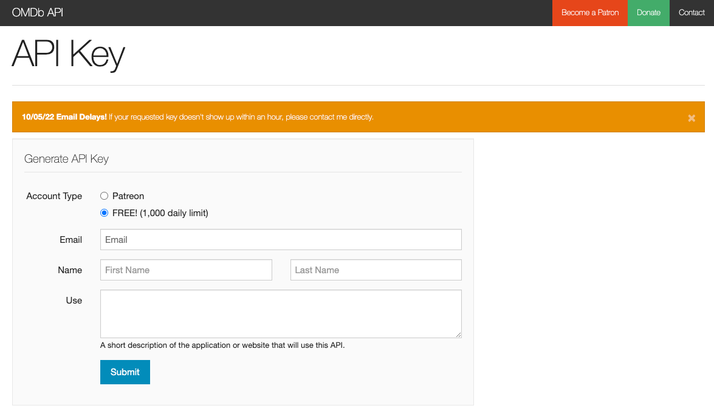
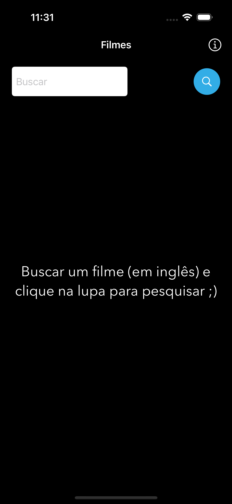
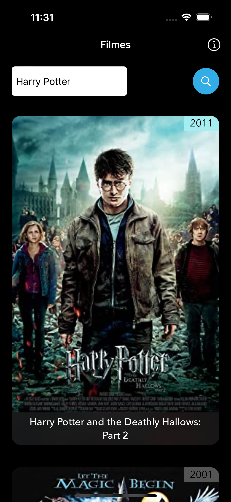

<h1>
    <b>Primeiro Aplicativo feito Swift 🚀</b>
     
</h1>

- Objetivo do aplicativo foi criar um App que faça busca de filmes utilizando uma API.
  
    - <i> API - https://www.omdbapi.com/apikey.aspx </i>  
`` Precisa solicitar um API KEY na OMDbAPI, no cadastro selecione a opção FREE e recebera a API Key no seu e-mail. ``
    
 

<b style= "font-size: 30px">Demonstrativo da tela do App</b>
  

<i style= "font-size: 13px"> doc de estudo - https://medium.com/mackmobile/usando-codables-em-swift-5-para-consumir-uma-api-de-filmes-356534e7e1f0 </i>

